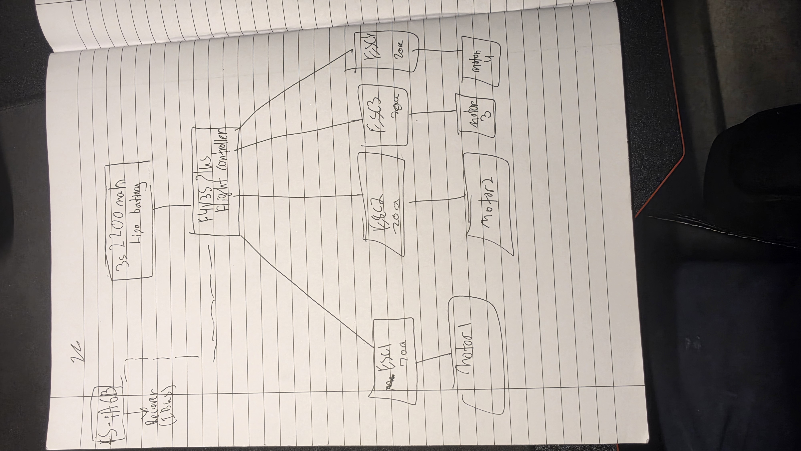

# Drone-v1
A fully 3D-printed FPV racing quadcopter, designed from scratch in Fusion 360. Custom X-frame built around 2205 2300KV motors, 5-inch props, and a Betaflight F4 flight controller. Engineered for a 220mm wheelbase with calculated prop clearance, reinforced stress points, and a heat-set insert mounting system. I will be using nylon female- female standoff screws to moutn the flight controller and the battery project.

## Design

## CAD Files
- [Frame (STL)](dronev1%20frame.stl)
- [Frame (STL)](dronev1frame.stl)
- [frame (STEP - editable)](Drone%20v1.step)
- .[Battery bracketSTEP - editable)](battery%20bracket.step) 
  
## Wiring diagram

## Bill of Materials

| Part | AED | USD |
|---|---|---|
| 2205 2300KV Motor Set (w/ ESC + Props) | 220.00 | $59.90 |
| Labymos F4 V3S Plus Flight Controller | 122.00 | $33.22 |
| **Total** | **342.00** | **$93.12** |

*Prices in UAE Dirhams (AED) and US Dollars (USD).
